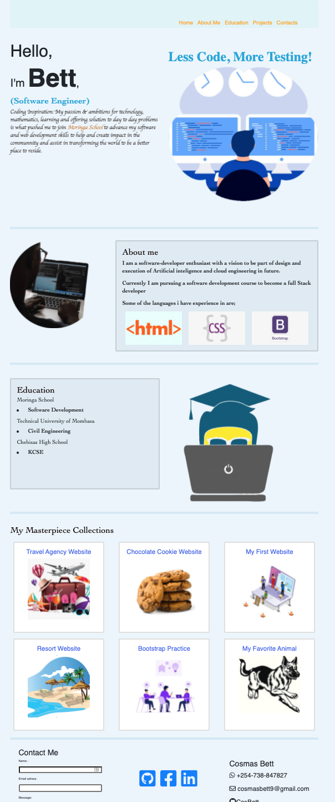

# Portfolio Landing Page
#### This is my portfolio landing web page to give more information about me, my coding inspiration,the programming languages I have experience in, my education background, the projects I have done as I learn how to code and contact information 

#### Latest Edition 16th Nov 2021

By Cosmas Bett

## Description

### Live demo
https://cosbett.github.io/Portfolio-Landing-Page/

The main purpose of the website is to give prospective clients and employers a chance to know me better in terms of educations, programing languages and skills. It serves as a platform for me to interact with anyone who is interested in my work.

*How to use
1. Open the page through this link https://cosbett.github.io/Portfolio-Landing-Page/ with your preferred browser.
2. It will take you to the page as show by screenshot above.
3. You can navigate through the page by scrolling or using the navigation on the top right of the page.
4. the page has a form for feedback form for any feedback

* How to clone this Web page
1. Click this link https://github.com/CosBett/Portfolio-Landing-Page
2. Fork this project to your local machine,
3. Open index.html file in any browser or edit using Code editor of your preference .

## Known Bugs
There is no know bugs at the moment 
## Technologies Used
Used HTML to set up the page structure, other technologies used are  CSS and Bootstrap to style and display the content of the page. 
##  Support and contact details
In case you have any feedback, impovement suggetion or collaboration, kindly let me know through the feedback section on the page or drop me a email through cosmasbett9@gmail.com

### License
*Copyright (c) 2021  CosBett

Permission is hereby granted, free of charge, to any person obtaining a copy
of this software and associated documentation files (the "Software"), to deal
in the Software without restriction, including without limitation the rights
to use, copy, modify, merge, publish, distribute, sublicense, and/or sell
copies of the Software, and to permit persons to whom the Software is
furnished to do so, subject to the following conditions:

The above copyright notice and this permission notice shall be included in all
copies or substantial portions of the Software.

THE SOFTWARE IS PROVIDED "AS IS", WITHOUT WARRANTY OF ANY KIND, EXPRESS OR
IMPLIED, INCLUDING BUT NOT LIMITED TO THE WARRANTIES OF MERCHANTABILITY,
FITNESS FOR A PARTICULAR PURPOSE AND NONINFRINGEMENT. IN NO EVENT SHALL THE
AUTHORS OR COPYRIGHT HOLDERS BE LIABLE FOR ANY CLAIM, DAMAGES OR OTHER
LIABILITY, WHETHER IN AN ACTION OF CONTRACT, TORT OR OTHERWISE, ARISING FROM,
OUT OF OR IN CONNECTION WITH THE SOFTWARE OR THE USE OR OTHER DEALINGS IN THE
SOFTWARE.}*
Copyright (c) 2021 **CosBett**
  
